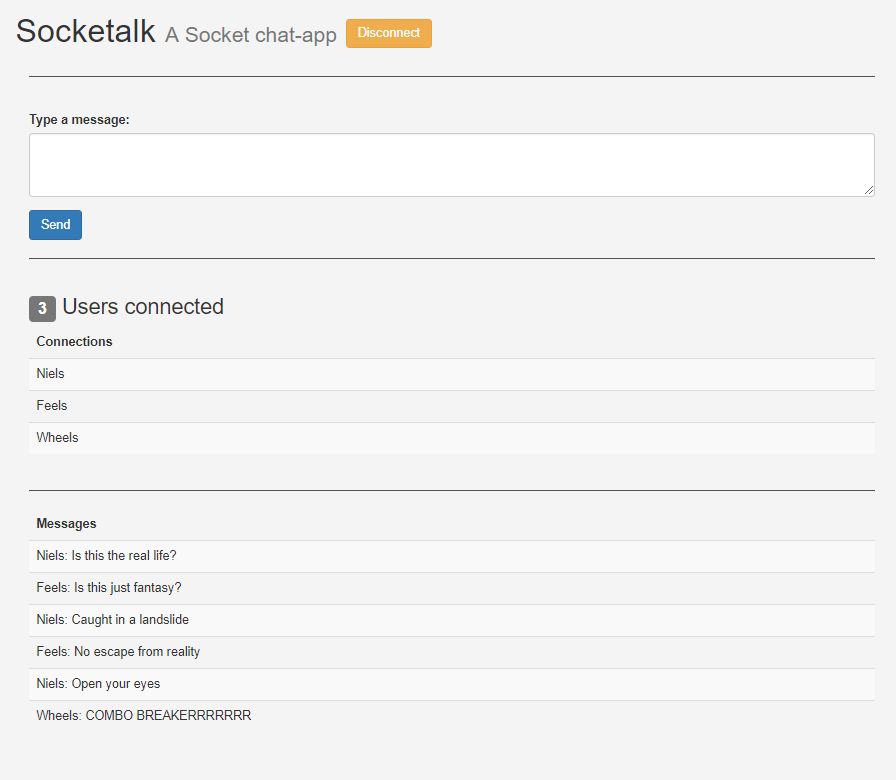

# Socketalk

A Spring Websocket chat-app

## Usage

- To run the build: `gradlew clean build`
- To start the application
    1. Launch `SocketalkApplication.java`
    2. Navigate to `localhost:8642` with multiple tabs in your browser.
    3. Press the `Connect` button in all tabs
    4. Chat with yourself...
    
## TODO's
- [ ] Angular frontend    
    
## Resources
- [STOMP Messaging using Spring Websockets](https://spring.io/guides/gs/messaging-stomp-websocket/)